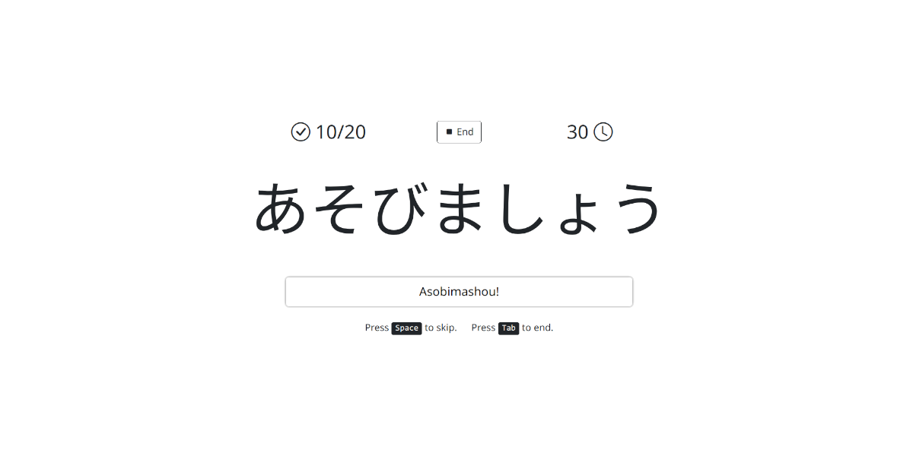

# Asobimashou! 遊びましょう! (Let's Play!)

### A minimal web app to practice reading Japanese Kana (Hiragana and Katakana) on the go




## Features

### Game Options

- Four different fonts
- Light and dark theme, auto-detected from system settings
- Quiz Type: Hiragana, Katakana, or both
- Word Bank: Random or JLPT N5-N4 words
- Toggle: Dakuten (`ﾞ`) and Handakuten (`ﾟ`)
- Toggle: Doubled consonants (`っ`)
- Toggle: Combo Kana (`ゃ`, `ゅ`, `ょ`)
- Toggle: Small vowels (`ぁ`, `ぃ`, `ぅ`, `ぇ`, `ぉ`)
- Toggle: Vowel length (`ー`)
- Toggle: Showing Kanji

### Gameplay

- Correct and skipped words counter
- Time counter
- Keyboard shortcuts
- Mobile-first design
- Touch-friendly
- Clean and simple interface
- Play offline (PWA)

### Results

- Correct answers counter
- Skipped words counter
- Total time counter
- Average time to answer
- Table with Romaji, English meaning, and link to [Jisho](https://jisho.org/)
- `Copy Table` button complete with Kanji, Kana, Romaji and English meaning
- `Share` button to copy your latest game statistics

## License

Distributed under the MIT License. See [LICENSE](LICENSE) for more information.

## Running Locally

### 1. Clone the repository

```sh
git clone https://github.com/rapjul/asobimashou.git
cd asobimashou
```

### 2. Start a web server

Use `npx serve .` or `python3 -m http.server 3000` for a quick local server.

```sh
npx serve .
```

or

```sh
python3 -m http.server 3000
```

### 3. Open the App in your Browser

Access the app at `http://localhost:3000`.

## Credits

This project is forked from [sglkc/asobimashou](https://github.com/sglkc/asobimashou).
